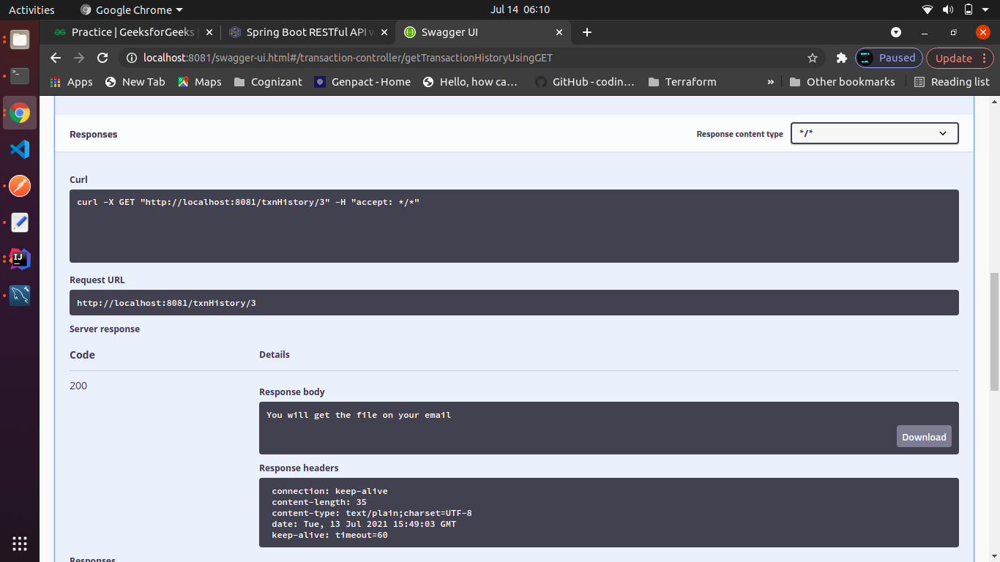
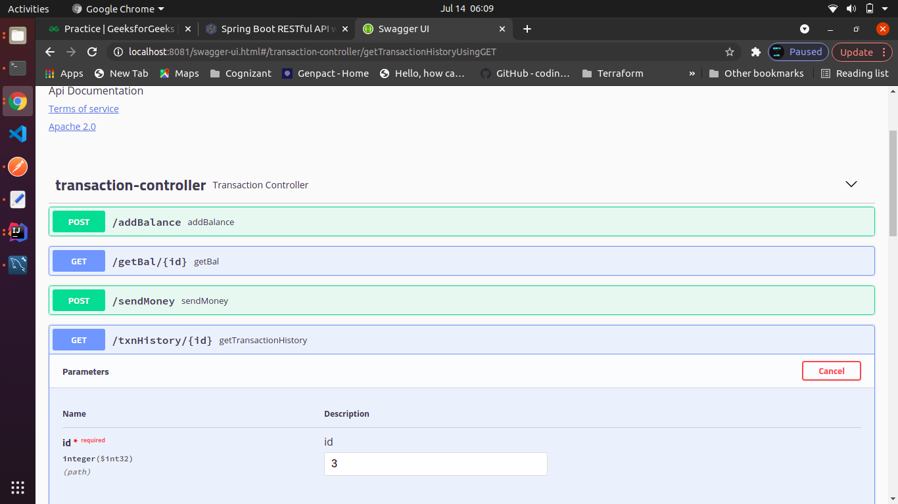

# E-Wallet

E-Wallet application is build upon two independent Micro services. 
The two services are UserService and WalletService.

# WalletService 
It a Spring Boot JPA application that stores user wallet information.

# UserService 
It is a Spring Boot JPA application that stores user information.

# Microservice Architecture

